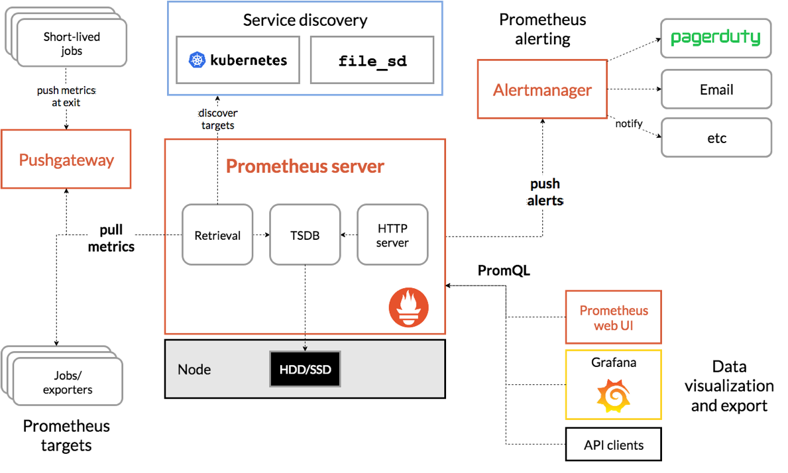
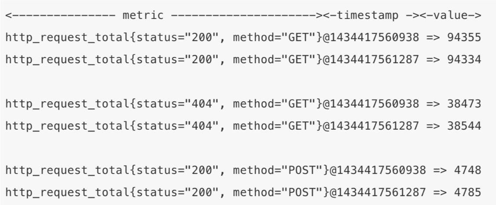

# Prometheus


## 简介
- Prometheus是由SoundCloud开发的开源监控告警系统。
- 基于Go语言开发，是Google BorgMon监控系统的开源版本。
- 2016年由Google发起的Linux基金会旗下的原生云基金会CNCF将其纳入第二大开源项目。

## 特点
- 提供多维度数据模型
- 灵活的查询方式
- 支持服务器节a点的本地存储和远程存储
- 定义了开放的指标数据标准
- 基于HTTP的Pull方式采集数据
- 支持通过静态文件和动态发现机制发现监控对象
- 易于维护
- 支持数据的分区采样和联邦部署


## 架构设计



## 核心组件
- Server： 负责定时在目标上抓取metrics(指标)数据。
- Target： 暴露一个HTTP服务接口用户Server抓取数据。
- AlertManager ： 接收server推送的告警信息，并触发告警。
- Grafana： 监控数据展示。
- Exporters: 用于暴露已有的第三方服务的 metrics 给 Prometheus。


## 监控指标

### 指标定义

 `<metric name>{<label name>=<label value>, ...},`
 
- 指标名称（metric name）:用于说明指标的含义,指标名称必须有字母、数字、下划线或者冒号组成
符合正则表达式 [a-zA-Z:][a-zA-Z0-9:],冒号不能用于exporter。
- 标签（label）: 体现指标的维度特性，用于过滤和聚合。通过标签名和标签值组成，键值对形式形成多种维度

### 实例
```
指标1 http_request_total{status="200",method="POST"}
指标2{__name__="http_request_total",status="200",method="POST"}
```

- 以上两个指标是一样，下划线开头的标签是系统内部使用的
- 指标名称： httprequesttotal 代表HTTP请求的总数
- 标签1： status 值 200， 代表状态码为200
- 标签2： method 值 POST，代表请求类型为POST

### 指标分类

#### Counter 计数器
- 计数器类型，只增不减，适用于机器启动时间、HTTP访问量
- 具有很好的不相关性，不会因为机器重启而置0
- 通常会结合rate()方法获取该指标在某个时间段的变化率

#### Gauge
- 仪表盘，表征指标的实时变化情况。
- 可增可减，CPU和内存使用量。
- 大部分监控数据类型都是Gauge类型的

#### Summary
- 高级指标，用于凸显数据的分布情况
- 某个时间段内请求的响应时间
- 可以与Histogram相互转化
- 采样点分位图统计，用于得到数据的分布情况
- 无需消耗服务端资源
- 与histogram相比消耗系统资源更多
- 计算的指标不能再获取平均数等其他指标
- 一般只适用于独立的监控指标，如垃圾回收时间等

#### Histogram
- 反映了某个区间内的样本个数，通过{le="上边界"}指定这个范围内的样本数。


### 数据样本
- Prometheus会将所有采集到的样本数据以时间序列（time-series）的方式保存在内存数据库中，并且定时保存到硬盘上。
- time-series是按照时间戳和值的序列顺序存放的，我们称之为向量(vector). 每条time-series通过指标名称(metrics name)和一组标签集(labelset)命名。


### 样本组成
- 指标(metric)：metric name和描述当前样本特征的labelsets;
- 时间戳(timestamp)：一个精确到毫秒的时间戳;
- 样本值(value)： 一个folat64的浮点型数据表示当前样本的值。




## 数据采集

和采用Push方式采集监控数据不通，Prometheus可采用Pull方式采集监控数据。

### Pull方式
#### 实时性
- 通过周期性采集，设置采集时间。实时性不如Push方式。

#### 状态保存
- target需要数据存储能力，server只负责数据拉取。
- server可以做到无状态。

#### 控制能力
- server更加主动，控制采集的内容和采集频率。

#### 配置的复杂性
- 通过批量配置或者自动发现来获取所有采集点。
- 相对简单，可以做到target充分解耦，无须感知server存在。

### Push方式
#### 实时性
- 相对较好，可以采集数据立即上报到监控中心。

#### 状态保存
- 在采集完成后立即上报，本地不会保存采集数据。
- target本身无状态，server需要维护各种target状态。

#### 控制能力
- 控制方为target，target上报的数据决定了上报的周期和内容。

#### 配置的复杂性
- 每个target都需要配置server的地址。


## 服务发现

### 静态配置
- 静态文件配置是一种传统的服务发现方式。
- 适用于有固定的监控环境、IP地址和统一的服务接口的场景。
- 需要在配置中指定采集的目标信息。
- 例如： “target”: [“10.10.10.10:8080”]


### 动态发现

- 比较适用在云环境下，动态伸缩、迅速配置。
- 容器管理系统、各种云管平台、各种服务发现组件。
- kubernetes为例：
  - 需要配置API的地址和认证凭据
  - prometheus一直监听集群的变化
  - 获取新增/删除集群中机器的信息，并更新采集对象列表。


## 数据存储

### 本地存储
- 通过自带的时序数据库将数据保存到本地的磁盘。

### 远端存储
- 适用于存储大量的监控数据
- 支持OpenTSDB、InfluxDB、ElasticSearch等后端存储
- 通过适配器实现存储的远程读写接口，便可以监控


## 数据查询

- Prometheus 通过PromQL和其他API可视化地展示收集的数据。
- Prometheus支持多种方式的图表可视化
  - Grafana
  - 自动的PromDash和自身提供的模板引擎等
- Prometheus 还提供了HTTP API查询方式，自定义所需输出。
