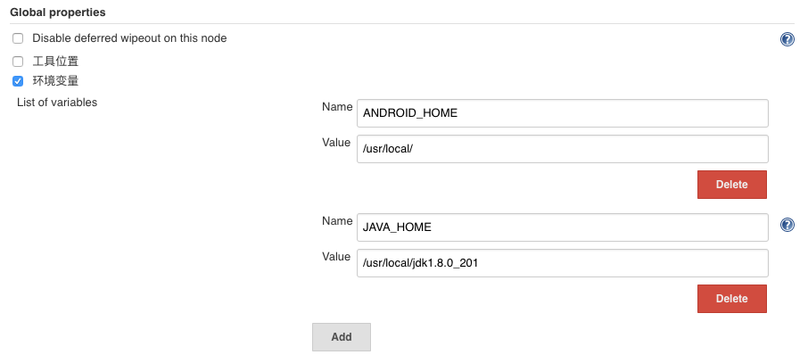
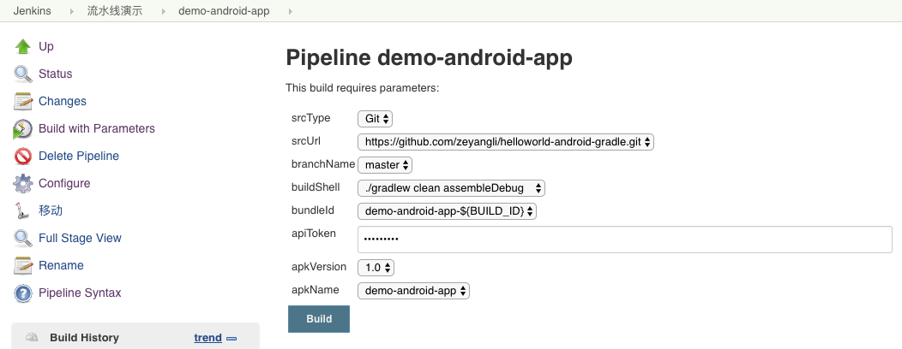
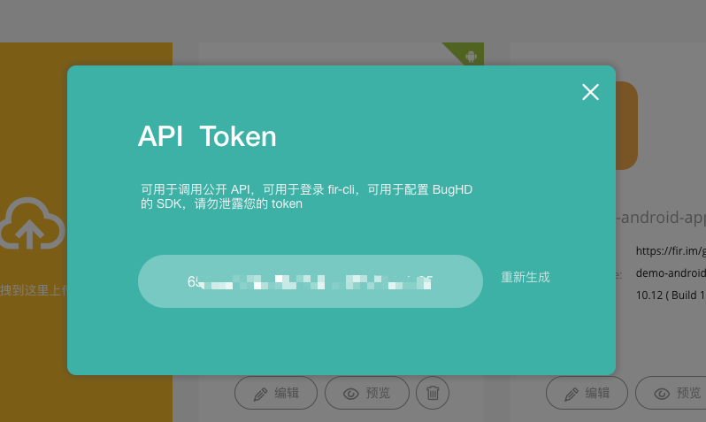
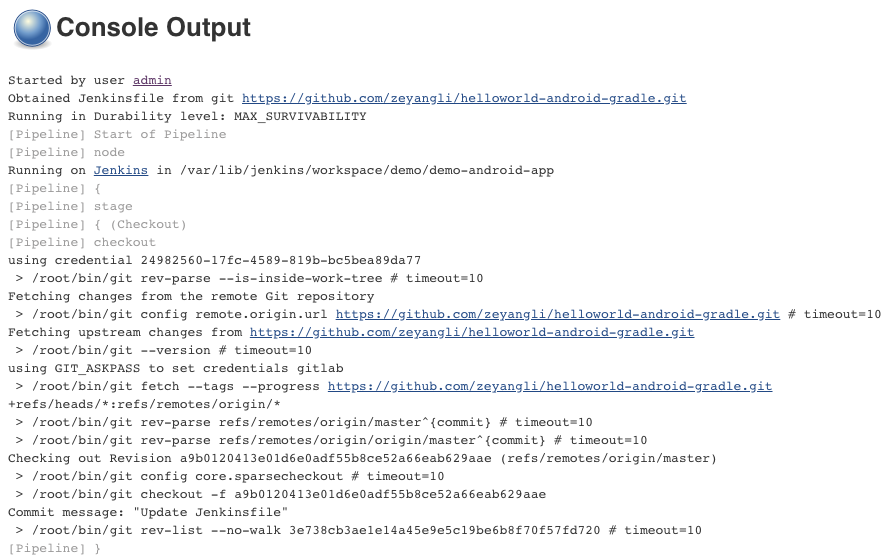
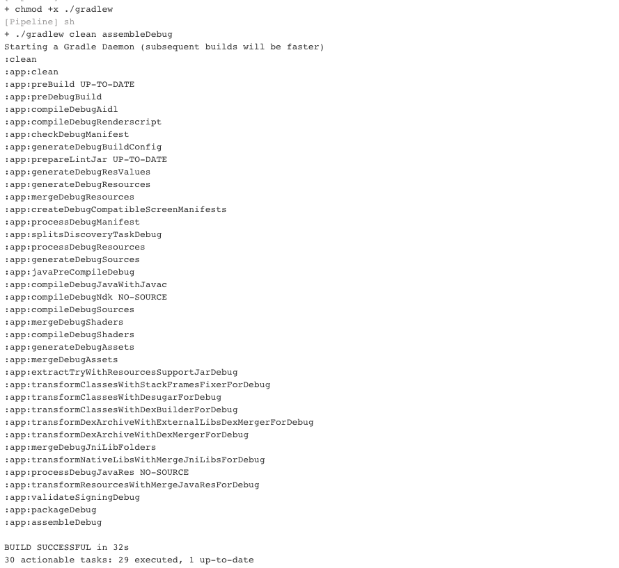
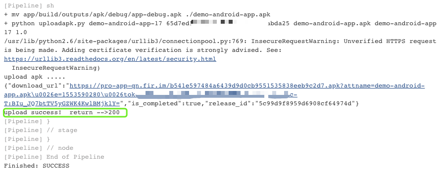
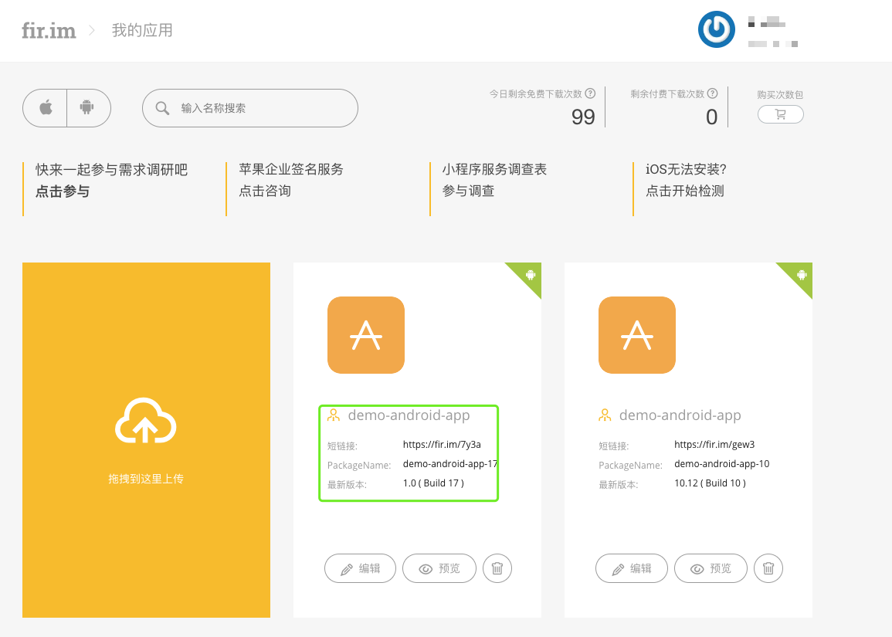

# Android项目发布流水线（demo）


## 1.项目配置

### 1.1 项目规范
- 打包存放路径: 统一在app/build/outputs/apk/[debug|release]目录下。

### 1.2 编写上传包脚本（Python）
参考文档： [fir.im平台发布应用API文档](https://fir.im/docs/publish)

- 获取上传凭证: 获取cert.binary中的数据。
- 上传APK: 定义包信息并上传。

```
#coding:utf8

import requests
import sys
import json

class ApkManage(object):
    def __init__(self):
        self.url = "http://api.fir.im/apps"    #平台API地址
    
    #获取上传凭证
    def getCert(self):
        dataargs = {'type' : 'android',
                    'bundle_id' : bundleid,
                    'api_token' : apitoken}

        response = requests.post(self.url,data=dataargs)
        #print(response.status_code,response.text)
        cert = json.loads(response.text)
        #print(cert)

        return cert['cert']['binary']
    
    #上传APK
    def apkUpload(self):
        certdata = self.getCert()
        
        try:
            print("upload apk .....")
            apkfile = {'file' : open(apkpath,'rb')}
            params = {"key"   : certdata['key'],
                      "token" : certdata['token'],
                      "x:name": appname ,
                      "x:build" : buildid,
                      "x:version" : appversion}
            response = requests.post(certdata['upload_url'],files=apkfile,data=params,verify=False)
            print(response.text)
            if int(response.status_code) == 200 :
                print("upload success!  return -->" + str(response.status_code))
            else:
                print("upload error! return -->" + str(response.status_code))


        except Exception as e:
            print("error: " + str(e))


if __name__ == '__main__':
    bundleid = sys.argv[1]
    apitoken = sys.argv[2]
    apkpath = sys.argv[3]
    appname = sys.argv[4]
    buildid = sys.argv[5]
    appversion = sys.argv[6]

    server = ApkManage()
    server.apkUpload()

```

使用方式

```
python upapk.py demo-android-app-10 65d7edxxxxxxx7c4fabda25 app.apk  demo-android-app 10 10.12
```


### 1.3 编写Jenkinsfile
Jenkinsfile简单的包含三个stage，分别是：

- Checkout: 检出代码（这种方式是直接获取Jenkinsfile的项目地址，Jenkinsfile在项目中可以这样写）。
- Build: 构建打包 (执行gradle构建命令)。
- Upload: 上传包到fir.im平台(更改包名，调用脚本上传)。

```
node("master"){
  stage("Checkout"){
    checkout scm
  }

  stage("Build"){
    sh 'chmod +x ./gradlew '
    sh " ${params.buildShell} "
  }
  
  stage("Upload"){
      sh """  
         mv app/build/outputs/apk/debug/app-debug.apk ./${params.apkName}.apk
         python uploadapk.py ${params.bundleId} ${params.apiToken} "${params.apkName}.apk" "${params.apkName}" "${BUILD_ID}" "${params.apkVersion}"
         
         """
  
  }
}

```


## 2.Jenkins配置

### 2.1 添加全局变量(android sdk)
导航->系统设置


### 2.2 创建Pipeline

这个项目因为Jenkinsfile和项目代码放在了一起，所以这个项目上的srcType、srcUrl、branchName参数暂时无效。

- buildShell : 打包命令(debug|release)。

	```
	./gradlew clean assembleDebug
	./gradlew clean assembleRelease
	```
- bundleId: App的bundleId（发布新应用时必填)。
- apiToken: 在fir.im平台创建。
获取用户token: 用户->apitoken


- apkVersion : apk的版本。
- apkName: apk的名称。


## 4.构建测试
检出代码

构建打包

发布APK


Fir平台



