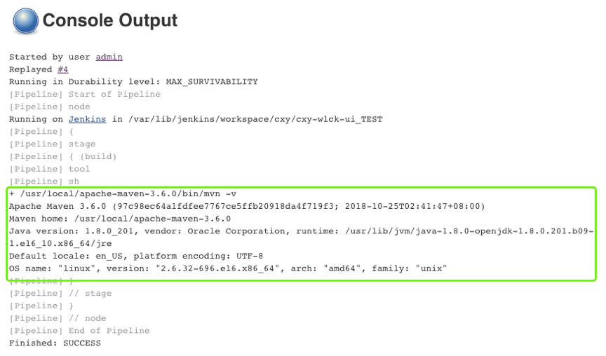
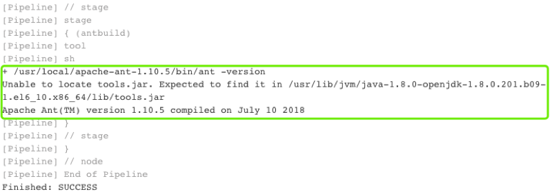
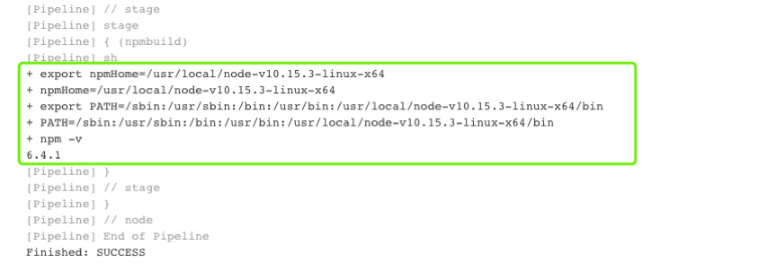
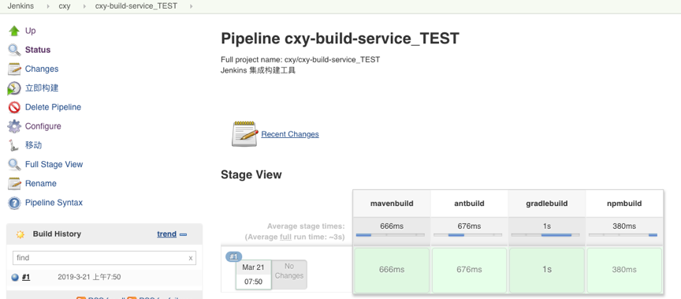

# 第五章 集成Jenkins(一)
## 1. 集成maven

### 1.1 先决条件
- JDK：在maven3.3 以上的版本需要JDK版本1.7+。内存：没有最低限制。
- 磁盘：1G+可用磁盘空间。 操作系统：没有限制。
- 下载maven [Download](http://maven.apache.org/download.cgi)


### 1.2 安装maven
```
tar zxf apache-maven-3.6.0-bin.tar.gz -C /usr/local/
#设置全局变量（/etc/profile）
export MAVEN_HOME=/usr/local/apache-maven-3.6.0
export PATH=$PATH:$MAVEN_HOME/bin
source /etc/profile

```

- 测试


### 1.3 Jenkins配置maven
- 系统设置->全局工具配置


- 编写Jenkinsfile

```
node {
    stage ("build"){
        mavenHome = tool 'M3'
        sh "${mavenHome}/bin/mvn -v"
    }
}

```

- 构建测试

到此jenkins集成maven就完成了。


### 1.4 maven常用命令
```
clean install -DskipTests
clean package 

```


## 2. 集成Ant

### 2.1 先决条件
- 下载：[Download](https://ant.apache.org/bindownload.cgi)


### 2.2 安装ant

```
tar zxf apache-ant-1.10.5-bin.tar.gz -C /usr/local/
#添加全局变量（/etc/profile）
export ANT_HOME=/usr/local/apache-ant-1.10.5
export PATH=$PATH:$MAVEN_HOME/bin:$ANT_HOME/bin
source /etc/profile

```

- 测试


### 2.3 Jenkins配置ant
- 系统设置->全局工具配置


- 编写Jenkinsfile

```
node {
    stage ("build"){
        antHome = tool 'ANT'
        sh "${antHome}/bin/ant -version"
    }
}

```

- 构建测试

到此ant的集成就完成了

### 2.4 Ant常用命令
```ant -buildfile -f build.xml ```


## 3. 集成Gradle

### 3.1 先决条件
- 下载: [Download](https://downloads.gradle.org/distributions/gradle-5.3-bin.zip)


### 3.2 安装Gradle
```
unzip gradle-5.3-bin.zip -d /usr/local/
#添加全局变量（/etc/profile）
export GRADLE_HOME=/usr/local/gradle-5.3
export PATH=$PATH: $GRADLE_HOME/bin
source /etc/profile

```

- 测试


### 3.3 Jenkins配置gradle
- 系统设置->全局工具配置


- 编写Jenkinsfile

```
node {
    stage ("gradlebuild"){
        gradleHome = tool 'GRADLE'
        sh "${gradleHome}/bin/gradle -v"
    }
}
```

- 构建测试

到此jenkins配置gradle完成


### 3.4 Gradle常用命令
- ./gradlew -v 版本号，首次运行，没有gradle的要下载的哦。
- ./gradlew clean 删除HelloWord/app目录下的build文件夹
- ./gradlew build 检查依赖并编译打包
- ./gradlew assembleDebug 编译并打Debug包
- ./gradlew assembleRelease 编译并打Release的包
- ./gradlew installRelease Release模式打包并安装
- ./gradlew uninstallRelease 卸载Release模式包


## 4.集成NPM

### 4.1 先决条件
- 下载[Download]( https://nodejs.org/en/download/)


### 4.2 安装Node

```
tar xf node-v10.15.3-linux-x64.tar.xz -C /usr/local/
#添加全局变量（/etc/profile）
export NODE_HOME=/usr/local/node-v10.15.3-linux-x64
export PATH=$PATH: $NODE_HOME/bin
source /etc/profile

```

- 测试


### 4.3 Jenkins配置Npm
- 在Jenkins全局工具配置中并没有node，可以直接通过Jenkinsfile定义使用。

- Jenkinsfile

```
node {
    stage ("npmbuild"){
        sh """
           export npmHome=/usr/local/node-v10.15.3-linux-x64
           export PATH=\$PATH:\$npmHome/bin
           npm -v
           """
    }    
}

```

- 构建测试



### 4.4 Npm常用构建命令
``` npm install && npm run build ```


## 总结



### [下一章](./第六章-集成Jenkins(二).md)       <---------> [上一章](./第四章-管理Jenkins(二).md)